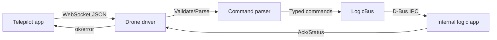
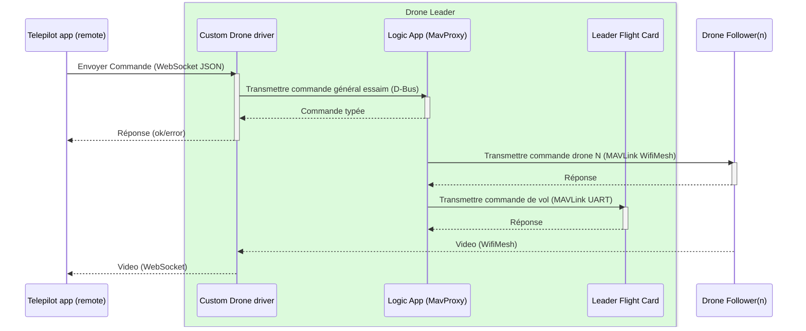
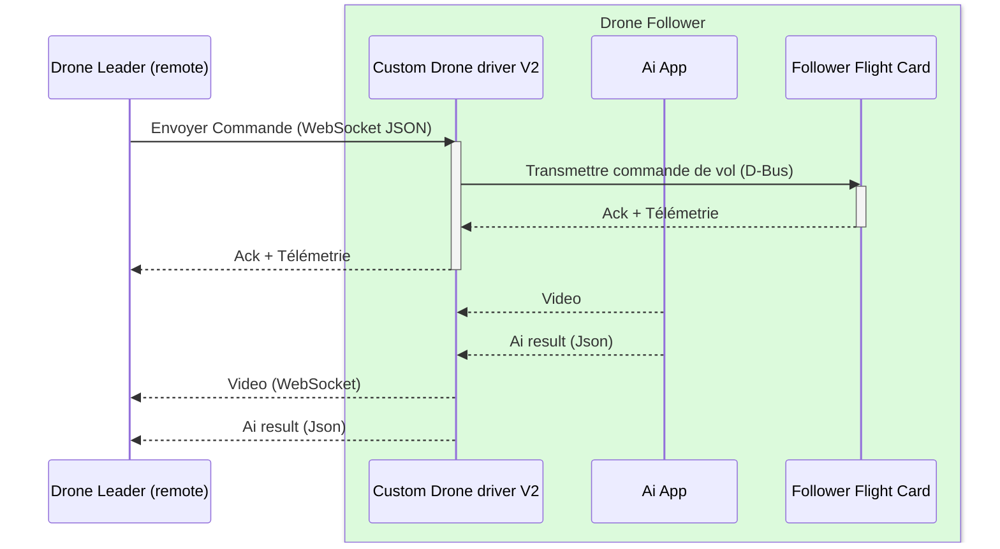

# Rust driver for drone control via WebSocket and D-Bus
Driver to run, extend, and trust on the Pi. Production-safe scaffold that keeps concerns isolated: WebSocket intake, command parsing/validation, and D-Bus dispatch to the internal logic app. It’s async, typed, and ready for logging and auth hardening.
## Structure
**Overview**: Modular crate with Tokio runtime, Tungstenite WebSocket, Serde JSON commands, and zbus for D-Bus IPC.

**Assumptions**: The internal logic exposes a D-Bus service and interface; you can wire in your methods. Commands are JSON from the telepilot app
```
drone-driver/
├─ Cargo.toml
└─ src/
   ├─ main.rs
   ├─ websocket.rs
   ├─ command.rs
   ├─ dbus.rs
   └─ error.rs
```
## Architecture

### Sequence Diagram Drone Leader


### Sequence Diagram Drone Follower

